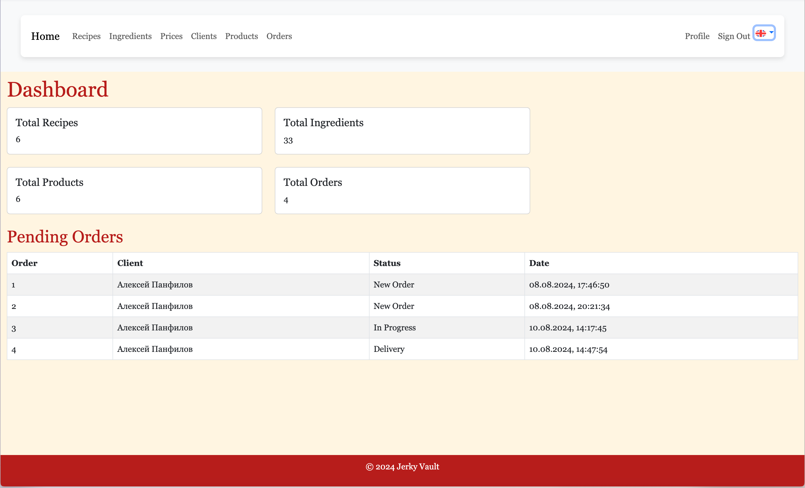
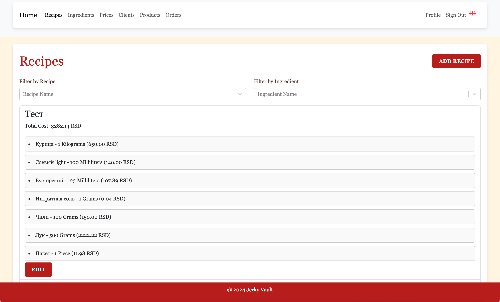
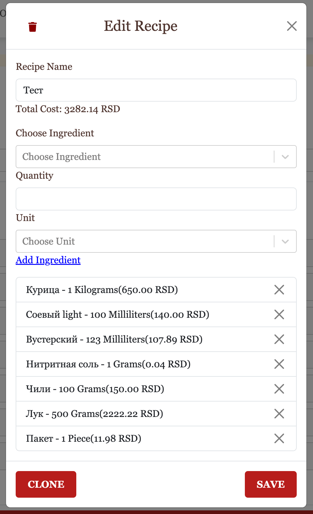
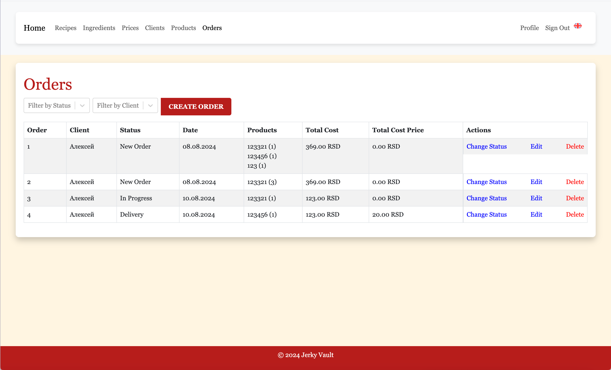
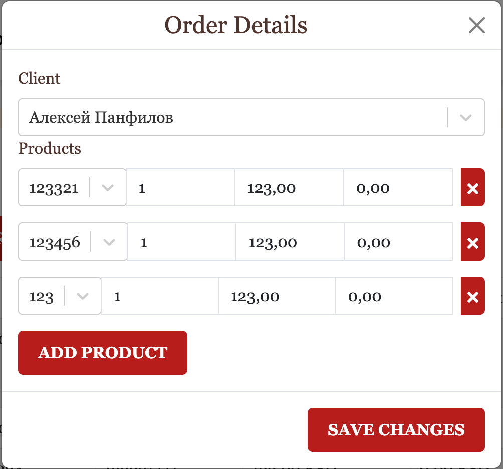
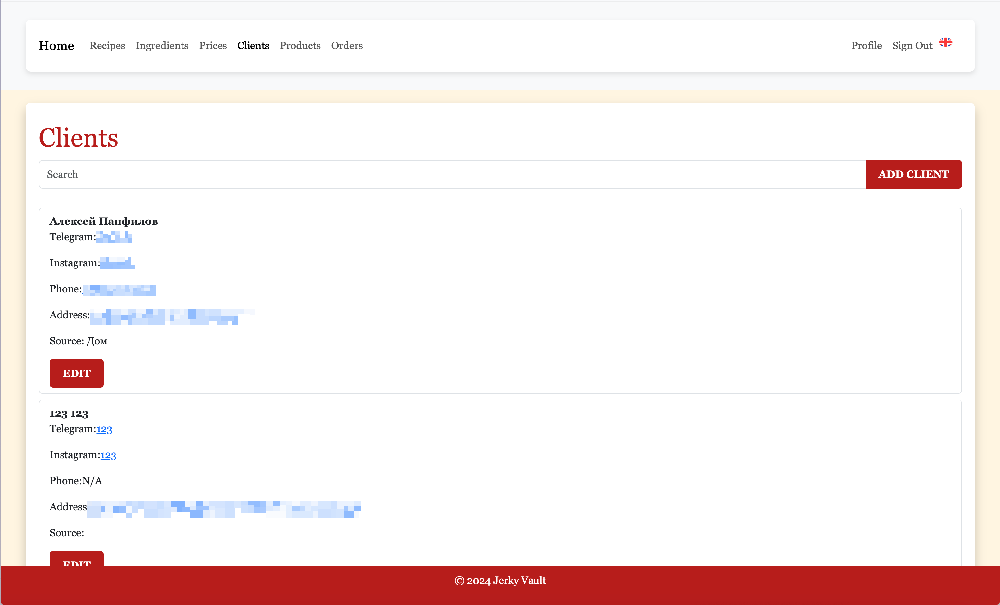
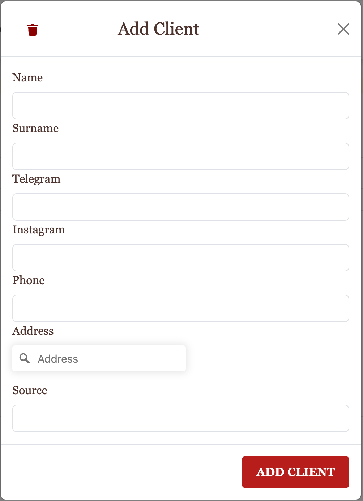
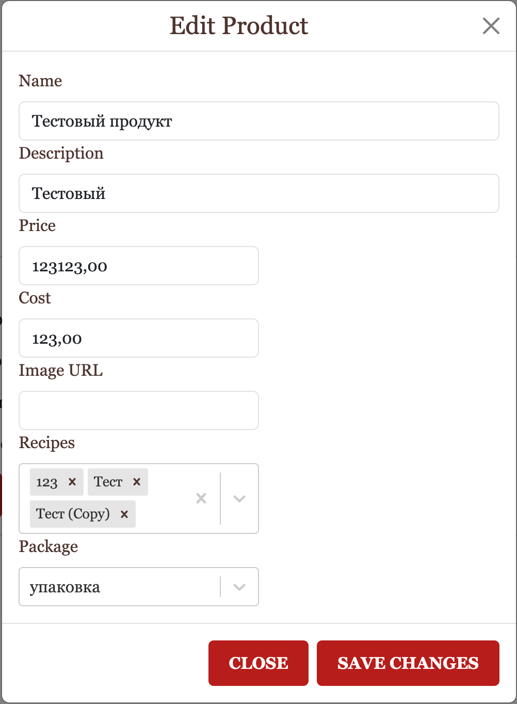

# JerkyVault

JerkyVault is a web application designed for managing recipes and orders for the production and sale of jerky. The project is built using modern web technologies such as **Next.js**, **Bootstrap**, and **MySQL**. The application is focused on ease of use, scalability, and user-friendliness, supporting multilingual functionality and secure authentication.

## Table of Contents

- [JerkyVault](#jerkyvault)
  - [Table of Contents](#table-of-contents)
  - [Key Features](#key-features)
    - [1. **User Registration and Authentication**](#1-user-registration-and-authentication)
    - [2. **Dashboard**](#2-dashboard)
    - [3. **Multilingual Support**](#3-multilingual-support)
    - [4. **User Interface**](#4-user-interface)
    - [5. **DevOps and CI/CD**](#5-devops-and-cicd)
  - [Website Sections](#website-sections)
    - [1. **Dashboard**](#1-dashboard)
    - [2. **Registration and Sign-In**](#2-registration-and-sign-in)
    - [3. **Recipes**](#3-recipes)
    - [4. **Orders**](#4-orders)
    - [5. **Clients**](#5-clients)
    - [6. **Products**](#6-products)
    - [7. **User Profile**](#7-user-profile)
  - [Technology Stack](#technology-stack)
  - [Installation and Setup](#installation-and-setup)
    - [1. Clone the Repository](#1-clone-the-repository)
    - [2. Install Dependencies](#2-install-dependencies)
    - [3. Set Up Environment Variables](#3-set-up-environment-variables)
    - [4. Localization Setup](#4-localization-setup)
    - [5. Run the Application](#5-run-the-application)
  - [Running the Application in Docker](#running-the-application-in-docker)
    - [1. Set Up Docker Environment](#1-set-up-docker-environment)
    - [2. Start the Docker Container](#2-start-the-docker-container)
  - [Development Commands](#development-commands)
  - [License](#license)

## Key Features

### 1. **User Registration and Authentication**

- **Registration**: The application provides users with the ability to register using a form that includes password confirmation. Data validation occurs on both the client and server sides, ensuring a high level of security.
- **Sign-In**: The sign-in functionality is implemented using NextAuth, which supports multiple authentication methods. Users can sign in using standard username and password.
- **Data Protection**: The use of CSRF tokens ensures protection against attacks at the form submission level for sign-in and registration.

### 2. **Dashboard**

- **Statistics**: The dashboard displays various statistical data, such as the total number of recipes, ingredients, products, and orders. Data visualization is implemented using **Chart.js**.
- **Charts**: The dashboard also features charts that show the distribution of product types (e.g., different types of jerky).
- **Order Tables**: The application allows viewing of pending orders, sorting them by various parameters, and tracking the status of orders.

### 3. **Multilingual Support**

- **Multiple Language Support**: The application supports English, Russian, and Serbian languages. Multilingual functionality is implemented using `next-translate`, making it easy to add and manage new translations.
- **Localized Interfaces**: All interfaces in the application, including forms, error messages, notifications, and tables, support language switching on the fly.

### 4. **User Interface**

- **Responsive Design**: The entire application interface is built using **Bootstrap** and **React Bootstrap**, ensuring responsiveness and a modern appearance across all device types.
- **Form Styling**: Registration, sign-in, and other forms used in the application are styled and include client-side data validation.

### 5. **DevOps and CI/CD**

- **Docker**: The application is packaged in Docker containers for easy deployment in various environments. `Docker Compose` support allows for local development and deployment in production environments.
- **GitHub Actions**: A CI/CD system is configured for automatic build and deployment of the project using GitHub Actions. This automates the process of testing and deploying the application.

## Website Sections

### 1. **Dashboard**

- **General Statistics**: A section with a summary of the number of recipes, ingredients, products, and orders.
- **Charts and Graphs**: A section displaying charts and graphs with data on product distribution, order statuses, and other important information.
- **Order Tables**: A section with tables showing all orders, with the ability to filter and sort by status, date, client, and other parameters.


### 2. **Registration and Sign-In**

- **Registration**: A page with a form for registering new users. Includes fields for username, password, and password confirmation. Localized success and error messages.
- **Sign-In**: A page for signing in existing users using username and password.

### 3. **Recipes**

- **View Recipes**: A list of all available recipes with sorting and filtering options by categories.
- **Add Recipe**: A form for adding new recipes, specifying ingredients, instructions, and other details.
- **Edit Recipes**: The ability to edit existing recipes, changing ingredients and other parameters.



### 4. **Orders**

- **View Orders**: A list of all orders with filtering options by status, creation date, and client.
- **Order Details**: View detailed information about each order, including products, quantities, status, and other details.
- **Manage Orders**: A section for changing order statuses and managing them.




### 5. **Clients**

- **View Clients**: A section displaying information about clients, including name, contact details, and order history.
- **Add and Edit Clients**: A form for adding new clients or editing information about existing clients.
- **Filtering and Sorting**: The ability to filter the list of clients by name, registration date, and other parameters.




### 6. **Products**

- **View Products**: A section where all available products are displayed, including types of jerky and other items.
- **Add Product**: A form for adding new products, specifying name, description, price, and other parameters.
- **Edit and Delete Products**: The ability to edit information about existing products or delete them.



### 7. **User Profile**

- **View Profile**: A section where users can view and edit their personal information, such as name, email, and other details.
- **Order History**: A section showing the history of all completed orders by the user.

## Technology Stack

- **Next.js**: A framework for React that provides server-side rendering and static site generation capabilities.
- **MySQL**: A relational database used for storing data about users, recipes, and orders.
- **Bootstrap and React Bootstrap**: A component library for creating a responsive and stylish interface.
- **NextAuth**: A library for user authentication and authorization.
- **Chart.js**: A library for creating charts and graphs, used in the dashboard.
- **Docker**: A platform for containerizing applications, ensuring portability and ease of deployment.
- **next-translate**: A library for adding multilingual support to Next.js projects.

## Installation and Setup

### 1. Clone the Repository

```bash
git clone https://github.com/username/JerkyVault.git
cd JerkyVault
```

### 2. Install Dependencies

```bash
npm install
```

### 3. Set Up Environment Variables

Create a `.env.local` file in the root of the project and add the necessary environment variables:

```env
NEXTAUTH_URL=http://localhost:3000
NEXTAUTH_SECRET=your_secret_key
DATABASE_URL=your_database_url
```

### 4. Localization Setup

Translation files are located in the `locales` directory. To add a new language, create the corresponding JSON file inside `locales/[language]/common.json`.

### 5. Run the Application

```bash
npm run dev
```

The application will be available at `http://localhost:3000`.

## Running the Application in Docker

### 1. Set Up Docker Environment

The project includes a `docker-compose.yml.example` file to facilitate running the application in Docker. Follow these steps to get started:

1. Rename `docker-compose.yml.example` to `docker-compose.yml`.

2. Update the environment variables in the `docker-compose.yml` file:

    ```yaml
    version: '3.8'

    services:
      app:
        image: dzarlax/jerky_vault:latest
        ports:
          - "3000:3000"
        network_mode: "host"
        environment:
          DATABASE_HOST: 'your_database_host'
          DATABASE_USER: 'your_database_user'
          DATABASE_PASSWORD: 'your_database_password'
          DATABASE_NAME: 'your_database_name'
          SECRET: 'your_secret_key'
          NEXTAUTH_URL: 'http://localhost:3000'
          NEXTAUTH_SECRET: 'your_nextauth_secret'
          JWT_SECRET: 'your_jwt_secret'
          MAPBOX_ACCESS_TOKEN: 'your_mapbox_access_token'
        command: /bin/sh -c "npm install && npm start"
    ```

### 2. Start the Docker Container

Run the following command to start the application using Docker:

```bash
docker-compose up
```

The application will be available at `http://localhost:3000` once the container is up and running.

## Development Commands

- `npm run dev` — Start the application in development mode.
- `npm run build` — Build the application for production.
- `npm run start` — Run the built application.
- `docker-compose up` — Start the project in Docker using Docker Compose.

## License

This project is licensed under the MIT License. See the [LICENSE](LICENSE) file for more details.
